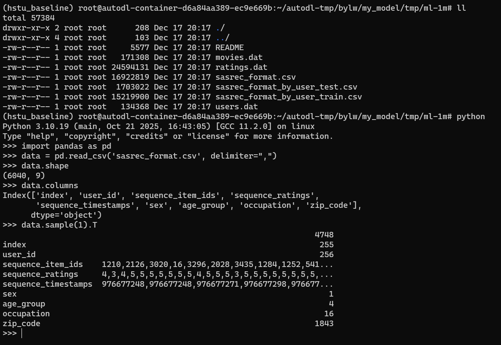

# data preprocess

## ml-1m
1. 原始数据格式
    * 经过preprocessor处理后，得到`sasrec_format.csv`

2. DatasetV3
    * 读取ratings_file
    * reverse+padding
        * padding是必须的，因为需要一个batch的数据进行stack
    * 相比V2改动
        * 将tgt与tgt_timestamp都保留到历史序列中
        * tgt_rating使用无效值`6`进行填充
        * 相应的，历史序列长度=max_seq_len+1
3. `interleave`格式处理
    * train函数中改动
        * 移除max_output_len
    * preprocess模块改动
        * 重写mask函数，将有效输入限定至tgt结束，不保留tgt_rating
4. ⭐数据处理
    * binarify: python data/data_cleaning.py
    * 一个序列扩展成多个: python data/data_augment.py